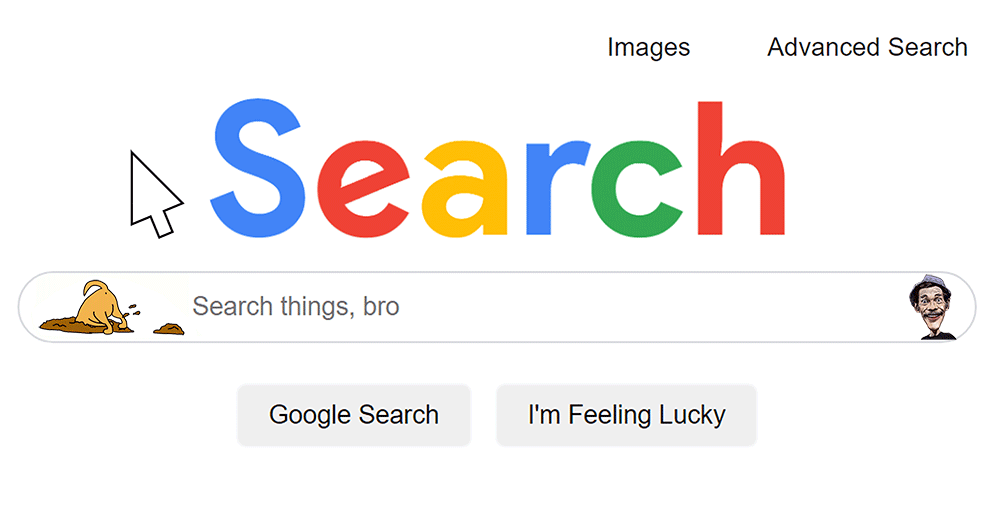
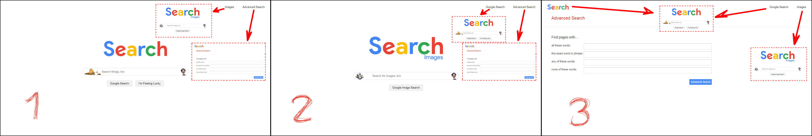
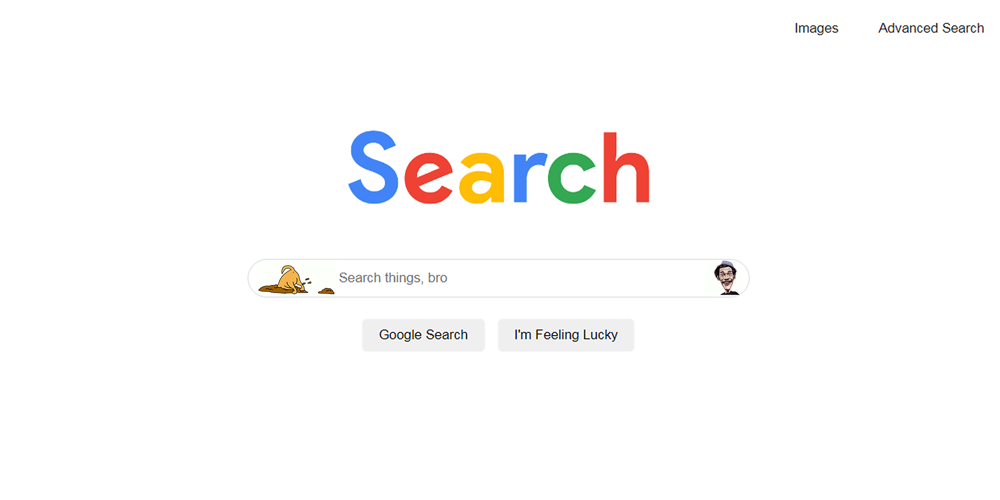
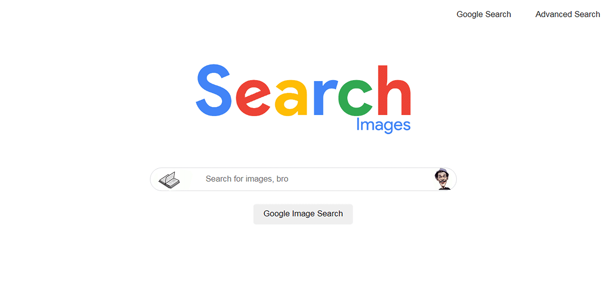
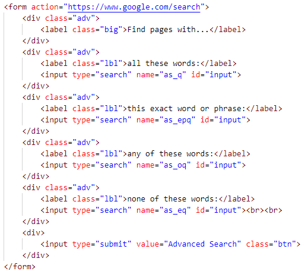
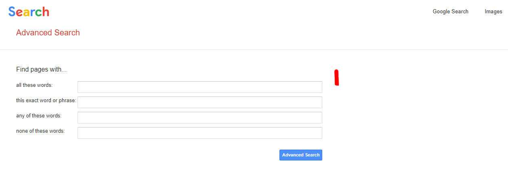
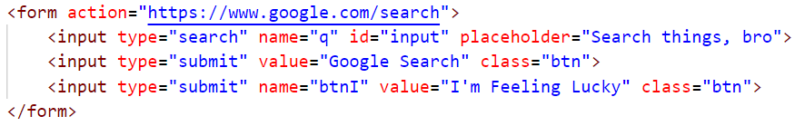
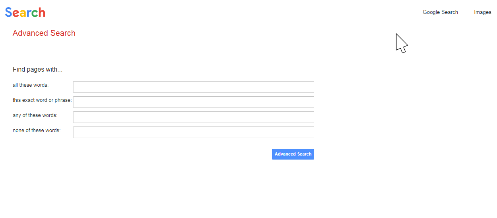

# Project 0, CS50W
#### Video Demo:  <https://www.youtube.com/watch?v=QKCBmgorK7I>

## Index
* [Title and Logo](#Title-and-Logo)
* [Badges](#badges)
* [Index](#index)
* [Project Description](#project-description)
* [Project Status](#project-status)
* [Application, Features and Requirements](#application-features-and-requirements)
* [Details](#details)
* [Developer](#developer)
* [License](#license)
* [Conclusion](#conclusion)

## Project Description

 The task proposed by CS50W is that we implement a web page that looks like Google Search Page. The behavior of the elements and the appearance of all content are the bigger challenge in this project in my point of view. Beyond the aesthetic question, the course asks us to put more two functionalities: the Google Image Search and the Advanced Google Search.

## Project Status
Despite the project being difficult for me, it is quite simpler than the (my) final project to CS50. So, I supposed that it is ready.

## Application, Features and Requirements

This work was made in HTML and CSS, so any ordinary browser will be able to run it. All the CSS instructions are inside the HTML file, for this task I preferred not to split them. I have a habit of putting animated and customized images in my works, maybe this part is the bigger requirements for this project: the image files for the web pages not run properly, but run in a exact way that I thought to do.

## Details

Here we can see all the details about the project:

### Pages

It was required by the course that the project should have at least three HTML pages: the main page, called index, for the <b>Regular Search</b>, one different page for <b>Image Search</b> and another one for <b>Advanced Search</b>. The main page should have links to go to the other pages and on these pages there should be link to go back to the first. All of these links should be on the upper-right of the page.

I made only three pages in this project and on each page I put links that allow us to go to any of the other two pages and not only to the main one.

### Search Page

On the main page, we should be able to type anything and be taken to the Google Search results. With <i>tag form</i> and some <i>CSS codes</i> this part wasn't much difficult to build. Even because the description of the task gives us the way to do this: if we put in the <i>tag form</i> the <i>action</i> as "<spam>https</spam>://www.google.com/search"</i> and the <i>name</i> of the <i>input</i> (which we must type our query) as <i>"q"</i>, all the magic happens when we click on the submit button.

 CS50W required that, like Google's own the search bar should be centered with rounded corners, with search buttons beneath it and also centered. I also added some items in order to customize my job, but without lose the appearance of pretending to be a Google Page:

## Image Search

Almost the same work was made here, with few differences like one button instead of two beneath the search bar and the change of the images that I used as icon and main logo. The upper-right buttons that already existed, but now one of them takes us to the main page and the other continues taking us to the Advanced Search page. If the user make a query, the results now will be in images like Google Image Search does, thanks to the <i>action "<spam>https</spam>://www.google.com/images"</i></i> inside the <i>tag form</i> instead of "<spam>https</spam>://www.google.com/search"</i> as was done in the index page. The <i>name</i> of the <i>input</i> must be the same: <i>"q"</i>. In general the codes underneath the roof suffer a few changes if we compare with the previous task.

## Advanced Search

The exercise required that it was possible the user provide input for the following four fields that were taken from the Google's own advanced options:

- `1`) Find pages with… “all these words:”
- `2`) Find pages with… “this exact word or phrase:”
- `3`) Find pages with… “any of these words:”
- `4`) Find pages with… “none of these words:”

The main difference here for the other pages is that now we have to deal with four <i>inputs</i> instead of only one. The big catch, then, was finding how Google manipulates all these entries. Looking in the source code, clicking on <i>F12</i> in the browser, we can see that the <i>action</i> inside the <i>tag form</i> is the same, <i>"<spam>https</spam>://www.google.com/search"</i>, but in this page the <i>name</i> of the each entry changes according its functionality:

## More Advanced Search

The course asks us in this project 0 to organize this page like the Google's own does. The four input fields should be stacked vertically, texts should be left aligned, “Advanced Search” button should be blue with white text and when this button is clicked, the user should be taken to the search results page for all given queries. This last order is possible thanks to the code that we just saw above.

## I'm Feeling Lucky

The duet "<i>name</i> plus <i>value</i>" will do all work for us in order to the functionality "<i>I'm Feeling Lucky</i>" runs properly with the <i>action "<spam>https</spam>://www.google.com/search"</i> inside the <i>tag form</i>:

## Aesthetics

 The aesthetic part gave a lot of work, but it was the funniest one. The exercise consisted in emulate the Google Search Page in its functionalities and, of course, in the appearance. When we hover the mouse cursor on some elements, they responses to us. Trying to copy all theses behaviors was the big challenge here.

Both on the main page as on the Image Search page:

- `1`) when we move the mouse over the two upper buttons, they get <i>underlined</i> and the <i>pointer</i>, which is an <i>arrow</i>, becomes a <i>hand</i>.
- `2`) when we move the mouse over the search bar, a shadow is shown behind it and its border line, which is gray, gets white or none, since the background is white too. The mouse pointer change from an <i>arrow</i> into a <i>text selector</i>.
- `3`) when we move the mouse over the buttons beneath the search bar, the <i>pointer</i> also becomes a <i>hand</i> like it happens on top the page. But, in this case, the buttons gain a subtle gray border and a slight shadow behind them.

On the Advanced Search page:

- `1`) when we move the mouse over the two upper buttons, they get <i>underlined</i> and the <i>pointer</i> which is an <i>arrow</i> becomes a <i>hand</i>, just as it happens with the main and the image pages.
- `2`) I added a hyperlink anchored on the logo, which is on the upper-left of the page, in order to takes us to the main page. So, when we move the mouse over the logo, the pointer becomes a <i>hand</i>.
- `3`) when we move the mouse over the input fields, the <i>pointer</i> changes itself in a <i>text selector</i>. If we click on one of them, it gains a inside shadow and its border color turns blue.
- `4`) when we move the mouse over the button beneath the input fields, the <i>pointer</i> doesn't becomes a <i>hand</i> here, instead it keeps its <i>arrow shape</i>. In this right moment too, the button assumes darkest colors: the blues of the background and border get stronger.

All of the tones of the colors (the exact gray, blue, etc), size of the elements, quantities of the blurs, shadows and radio for the corners of the buttons and inputs, angles and directions of the shadows, were a work that was done with big attention. The precise code of palette was captured and implemented inside the CSS code.

## Developer
I'm really honored in begin to make part of this world of programming. My name is Raphael Freitas. I'm Brazilian, I'm from Lorena (my city) São Paulo (my state) and my contact is raphaeuaf@yahoo.com.br.

## License
I think my work is free, right?

## Conclusion

I want to thank <b>Harvard University / EDX</b> to open this oportunity of studying to people like me. I never could imagine studying programming (in/from Harvard!), even though I always wanted. <b>EDX / Harvard</b> provided it to me and I am really, really grateful.
